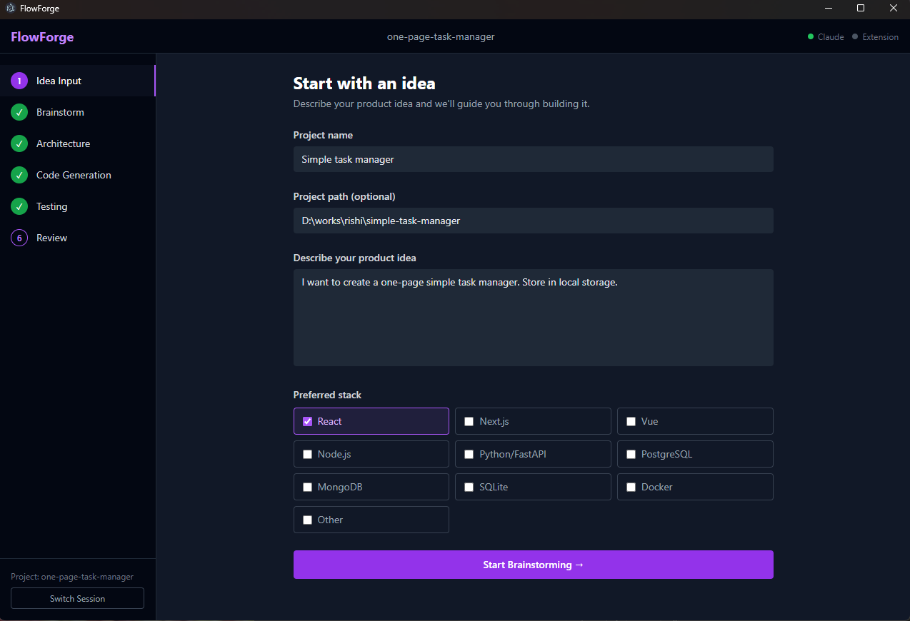
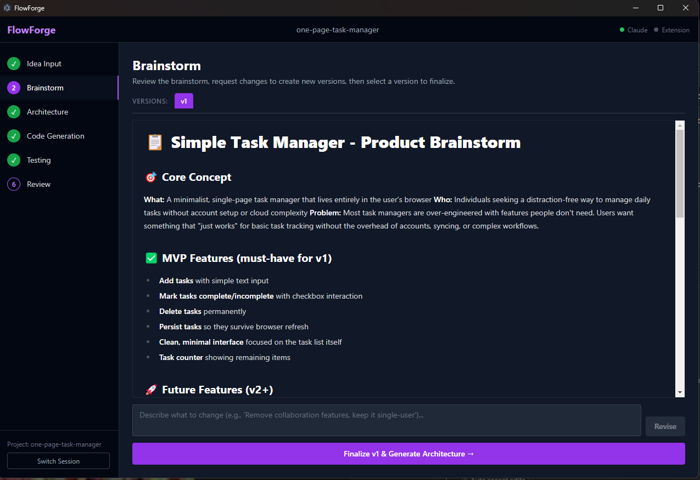
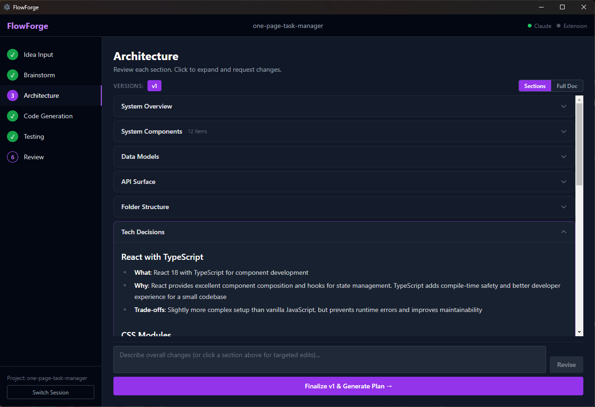
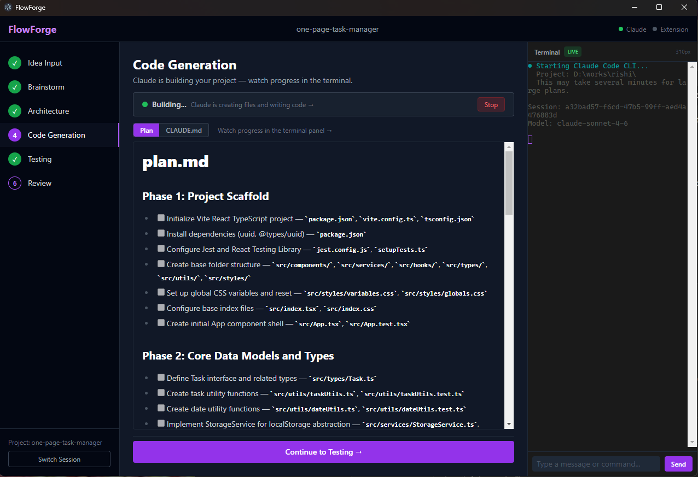
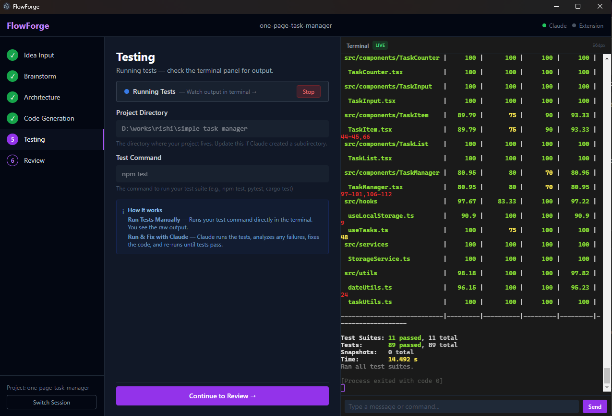

# Archon — Idea-to-Product Orchestrator

A desktop app that wraps Claude Code in a step-by-step visual wizard.
Input a product idea and get a fully scaffolded, tested codebase — with human-in-the-loop checkpoints at every stage.

## The Problem

Turning a product idea into working code today involves juggling multiple tools and manually managing a multi-step workflow:

- **Prompt engineering** — crafting the right prompts for each stage (brainstorm, architecture, code)
- **Context loss** — AI tools don't carry context from ideation through to implementation
- **No guardrails** — AI can generate code without structure, skipping architecture and testing
- **Manual orchestration** — copy-pasting outputs between tools, managing files, running CLI commands

## Screenshots

### Idea Input


### Brainstorm (Versioned)


### Architecture (Interactive Sections)


### Code Generation (Live Terminal)


### Testing


## How It Works

```
Idea Input → Brainstorm → Architecture → Code Generation → Testing → Review
```


| Stage               | What Happens                                                                                                                                                          |
| ------------------- | --------------------------------------------------------------------------------------------------------------------------------------------------------------------- |
| **Idea Input**      | Enter your product idea, select tech stack preferences, and set a project directory                                                                                   |
| **Brainstorm**      | AI generates a product exploration (features, user stories, edge cases). Request revisions — each creates a **new version**, and you can pick any version to finalize |
| **Architecture**    | AI generates a full architecture document. Edit **individual sections** or request global changes. Versioned like Brainstorm                                          |
| **Code Generation** | Claude Code CLI executes the plan — creating directories, writing files, installing dependencies. Real-time streaming output in an integrated terminal                |
| **Testing**         | Run tests manually or let Claude auto-fix failing tests                                                                                                               |
| **Review**          | Git status/diff/log, Claude-powered code review, and commit workflow                                                                                                  |


## Key Capabilities

- **Versioned Iterations** — Brainstorm and Architecture stages maintain version history. Compare versions and select any previous version to proceed with.
- **Interactive Section Editing** — Architecture is broken into collapsible cards. Request changes to specific sections without regenerating the entire document.
- **Integrated Terminal** — Resizable terminal panel with copy/paste support shows real-time Claude CLI output.
- **Human-in-the-Loop** — Every stage transition requires user approval. No code is generated or committed without explicit action.

## Prerequisites

- Node.js 20+
- Claude Code CLI installed (`npm install -g @anthropic-ai/claude-code`)
- Anthropic API key

## Quick Start

```bash
git clone https://github.com/rishithakkar/archon.git
cd archon
npm install

# Set your Anthropic API key
cp .env.example .env
# Edit .env → add ANTHROPIC_API_KEY=sk-ant-...

# Run in development
npm run dev
```

## Tech Stack


| Layer         | Technology                                                                         |
| ------------- | ---------------------------------------------------------------------------------- |
| Desktop Shell | Electron 32 + React 18 + TypeScript 5                                              |
| UI            | Tailwind CSS 3 + Radix UI                                                          |
| Build         | Vite + electron-vite                                                               |
| AI            | Anthropic SDK (brainstorm/architecture), Claude Code CLI (code gen/testing/review) |
| Storage       | SQLite via better-sqlite3                                                          |
| Terminal      | xterm.js with real-time streaming                                                  |


## Architecture

```
┌─────────────────────────────────────────────┐
│              Electron Main Process          │
│  ┌──────────┐ ┌──────────┐ ┌─────────────┐ │
│  │ Claude   │ │ PTY      │ │ Session     │ │
│  │ Bridge   │ │ Manager  │ │ Store       │ │
│  │(API SDK) │ │(CLI spawn│ │ (SQLite)    │ │
│  └────┬─────┘ └────┬─────┘ └──────┬──────┘ │
│       │IPC         │IPC           │IPC      │
├───────┼────────────┼──────────────┼─────────┤
│       ▼            ▼              ▼         │
│              Renderer Process               │
│  ┌──────────────────────────────────────┐   │
│  │  React App (Zustand Store)           │   │
│  │  ┌────────┐ ┌──────────┐ ┌────────┐ │   │
│  │  │Sidebar │ │Stage View│ │Terminal│ │   │
│  │  │(Nav)   │ │(6 stages)│ │(xterm) │ │   │
│  │  └────────┘ └──────────┘ └────────┘ │   │
│  └──────────────────────────────────────┘   │
└─────────────────────────────────────────────┘
```

## What Makes It Different

1. **Structured workflow** — enforces a proven sequence instead of free-form prompting
2. **Context continuity** — each stage's output feeds into the next automatically
3. **Version control built-in** — every iteration is preserved, not overwritten
4. **Real CLI integration** — actual Claude Code CLI with file system access
5. **Desktop-native** — runs locally, no cloud dependency beyond the AI API

